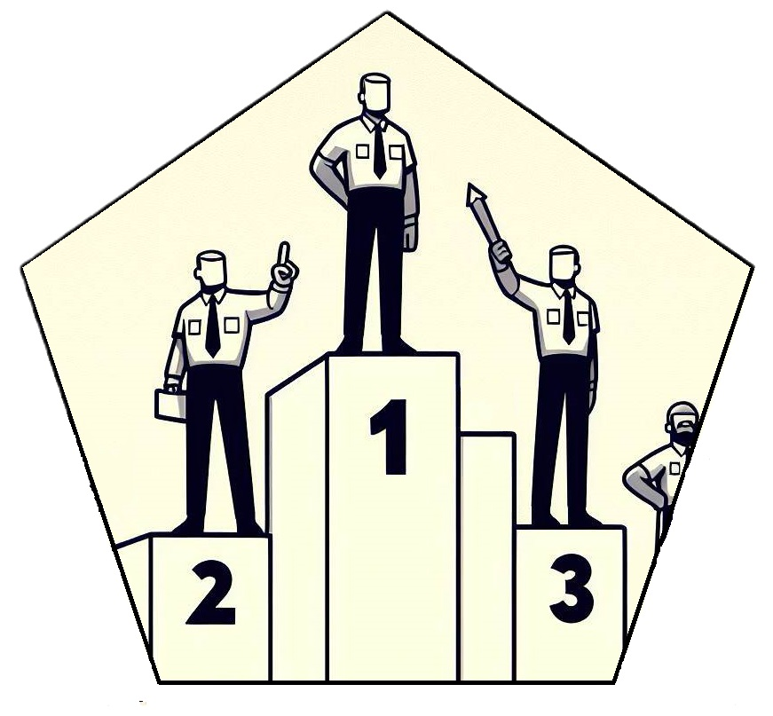

<!-- README.md is generated from README.Rmd. Please edit that file -->

```{r, include = FALSE}
knitr::opts_chunk$set(
  collapse = TRUE,
  comment = "#>",
  fig.path = "man/figures/README-",
  out.width = "100%"
)
```

# rankr 

<!-- badges: start -->
  [](https://app.codecov.io/gh/JonasMoss/rankr?branch=main)
[](https://CRAN.R-project.org/package=rankr)
<!-- badges: end -->

An `R` package for calculating varieties of Kendall's tau in O(nlog(n)) time. Bias-corrected accelerated bootstrap[^10] supported. Designed to facilitate the computation of the new tau varieties in Moss (2024, WIP), but supports most variants of tau in the literature.

**Work in progress!** Analytical confidence intervals hopefully coming soon, along with a preprint describing the new variants of tau and their rationale. Expect breaking changes to the API.

## Installation

You can install the development version of `rankr` from [GitHub](https://github.com/) with:

``` r
# install.packages("remotes")
remotes::install_github("JonasMoss/rankr")
```

## Example

The cylinder covariate in the `mtcars` is almost a weakly decreasing function of the miles per gallon covariate. On the other hand, miles per gallon is not a monotone function of cylinder:

```{r}
par(mfrow=c(1,2))
plot(mtcars$mpg, mtcars$cyl, xlab = "Miles per gallon", ylab = "Cylinders")
plot(mtcars$cyl, mtcars$mpg, xlab = "Cyliders", ylab = "Miles per gallon")
```
The `rankr` package supports caclulation of several variants of Kendall's tau. Most importantly, it supports the weakly monotone tau (Moss, 2024).

```{r example}
library("rankr")
c(tau(mtcars$mpg, mtcars$cyl), tau(mtcars$cyl, mtcars$mpg))
```
Both numbers are negative, implying the best-fitting monotone function is decreasing. The first number is almost -1, implying that `cyl` is almost perfectly a weakly decreasing function of `mpg`. The second number is merely `-0.34`, implying there is only a weak monotone functional relationship `mpg = f(cyl)`. 

Calculate approximate confidence intervals using the bias-corrected and accelerated bootstrap (BCa):

```{r}
set.seed(313)
tau_ci(mtcars$mpg, mtcars$cyl, "tau")
tau_ci(mtcars$cyl, mtcars$mpg, "tau")
```

## Additional functionality
Most variants of tau in the literature can be calculated by `rankr`. All computations are O(nlog(n)).

```{r, echo = FALSE}
results <- rbind(c(tau(mtcars$mpg, mtcars$cyl), tau(mtcars$cyl, mtcars$mpg)),
  c(tau_strict(mtcars$mpg, mtcars$cyl), tau_a(mtcars$cyl, mtcars$mpg)),
  c(tau_a(mtcars$mpg, mtcars$cyl), tau_a(mtcars$cyl, mtcars$mpg)),
c(tau_b(mtcars$mpg, mtcars$cyl), tau_b(mtcars$cyl, mtcars$mpg)),
c(tau_c(mtcars$mpg, mtcars$cyl), tau_c(mtcars$cyl, mtcars$mpg)),
c(gk_gamma(mtcars$mpg, mtcars$cyl), gk_gamma(mtcars$cyl, mtcars$mpg)),
c(somers_d(mtcars$mpg, mtcars$cyl), somers_d(mtcars$cyl, mtcars$mpg)),
c(wilsons_e(mtcars$mpg, mtcars$cyl), wilsons_e(mtcars$cyl, mtcars$mpg)),
c(lg_d(mtcars$mpg, mtcars$cyl), lg_d(mtcars$cyl, mtcars$mpg)))
func <- c("`tau`", "`tau_strict`","`tau_a`", "`tau_b`", "`tau_c`", "`gk_gamma`", "`somers_d`", "`wilsons_e`", "`lg_d`")
symmetric <- c("𐄂","𐄂","🗸","🗸","🗸","🗸","𐄂","🗸","𐄂")
results <- cbind(func, round(results, 3), symmetric)
rownames(results) <- c("Generalized tau[^1]", "Strict generalized tau[^1]", "Kendall's tau (a)[^2]", "Kendall's tau (b)[^3]", "Stuart's tau (c)[^4]", "Goodman--Kruskall gamma[^5]", "Somer's D[^6]", "Wilson's E[^7]", "Leik--Gove D[^8]")
colnames(results) <- c("Function", "cyl ~ mpg", "mpg ~ cyl", "Symmetric?")
knitr::kable(results)
```
[^7]: Wilson, T. P. (1974). Measures of association for bivariate ordinal hypotheses. In H. Blalock (Ed.), Measurement in the Social Sciences. Taylor Francis. https://doi.org/10.4324/9781351329088-14

[^2]: Kendall, M. G. (1938). A New Measure of Rank Correlation. Biometrika, 30(1/2), 81–93. https://doi.org/10.2307/2332226

[^5]: Somers, R. H. (1962). A New Asymmetric Measure of Association for Ordinal Variables. American Sociological Review, 27(6), 799–811. https://doi.org/10.2307/2090408

[^4]: Stuart, A. (1953). The Estimation and Comparison of Strengths of Association in Contingency Tables. Biometrika, 40(1/2), 105–110. https://doi.org/10.2307/2333101

[^1]: Moss, J. (2024). Kendall's tau and proportional reduction in risk: New generalizations for tied data (WIP)

[^8]: Leik, R. K., & Gove, W. R. (1969). The Conception and Measurement of Asymmetric Monotonic Relationships in Sociology. The American Journal of Sociology, 74(6), 696–709. https://doi.org/10.1086/224720

[^6]: Goodman, L. A., & Kruskal, W. H. (1979). Measures of Association for Cross Classifications. In L. A. Goodman & W. H. Kruskal (Eds.), Measures of Association for Cross Classifications (pp. 2–34). Springer New York. https://doi.org/10.1007/978-1-4612-9995-0_1

[^3]: Kendall, M. G. (1945). The treatment of ties in ranking problems. Biometrika, 33, 239–251. https://doi.org/10.1093/biomet/33.3.239

[^10]: Efron, B. (1987). Better Bootstrap Confidence Intervals. Journal of the American Statistical Association, 82(397), 171–185. https://doi.org/10.2307/2289144
