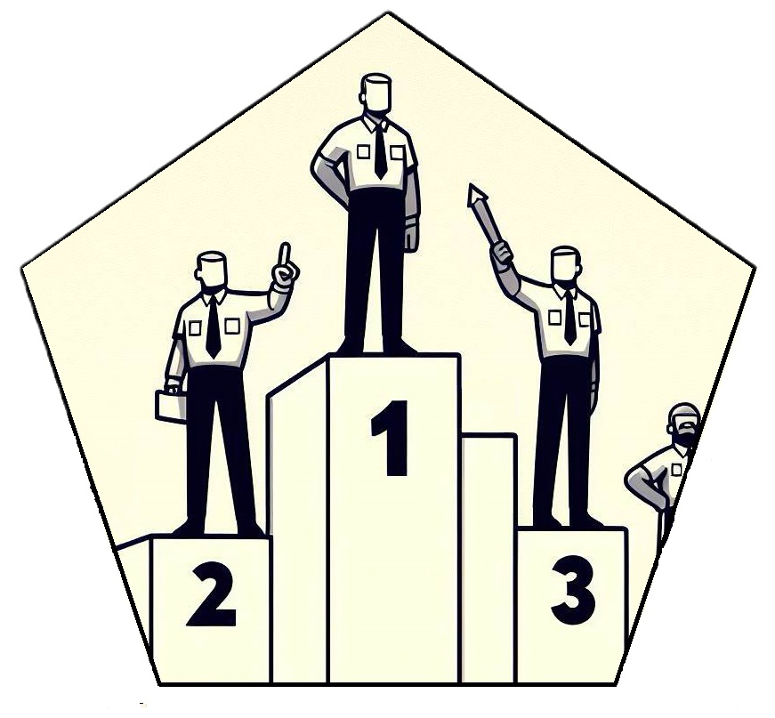

<!-- README.md is generated from README.Rmd. Please edit that file -->

# rankr 

<!-- badges: start -->

[](https://app.codecov.io/gh/JonasMoss/rankr?branch=main)
[](https://CRAN.R-project.org/package=rankr)
[](https://github.com/JonasMoss/rankr/actions/workflows/R-CMD-check.yaml)
<!-- badges: end -->

An `R` package for calculating varieties of Kendall’s tau in O(nlog(n))
time. Bias-corrected accelerated bootstrap[^1] supported. Designed to
facilitate the computation of the new tau varieties in Moss (2024, WIP),
but supports most variants of tau in the literature.

**Work in progress!** Analytical confidence intervals hopefully coming
soon, along with a preprint describing the new variants of tau and their
rationale. Expect breaking changes to the API.

## Installation

You can install the development version of `rankr` from
[GitHub](https://github.com/) with:

``` r
# install.packages("remotes")
remotes::install_github("JonasMoss/rankr")
```

## Example

The cylinder covariate in the `mtcars` is almost a weakly decreasing
function of the miles per gallon covariate. On the other hand, miles per
gallon is not a monotone function of cylinder:

``` r
par(mfrow=c(1,2))
plot(mtcars$mpg, mtcars$cyl, xlab = "Miles per gallon", ylab = "Cylinders")
plot(mtcars$cyl, mtcars$mpg, xlab = "Cyliders", ylab = "Miles per gallon")
```

 The
`rankr` package supports caclulation of several variants of Kendall’s
tau. Most importantly, it supports the weakly monotone tau (Moss, 2024).

``` r
library("rankr")
c(tau(mtcars$mpg, mtcars$cyl), tau(mtcars$cyl, mtcars$mpg))
#> [1] -0.9819005 -0.3399602
```

Both numbers are negative, implying the best-fitting monotone function
is decreasing. The first number is almost -1, implying that `cyl` is
almost perfectly a weakly decreasing function of `mpg`. The second
number is merely `-0.34`, implying there is only a weak monotone
functional relationship `mpg = f(cyl)`.

Calculate approximate confidence intervals using the bias-corrected and
accelerated bootstrap (BCa):

``` r
set.seed(313)
tau_ci(mtcars$mpg, mtcars$cyl, "tau")
#>      0.025      0.975 
#> -0.9971223 -0.8999599
tau_ci(mtcars$cyl, mtcars$mpg, "tau")
#>      0.025      0.975 
#> -0.4203455 -0.1149544
```

## Additional functionality

Most variants of tau in the literature can be calculated by `rankr`. All
computations are O(nlog(n)).

|                            | Function     | cyl ~ mpg | mpg ~ cyl | Symmetric? |
|:---------------------------|:-------------|:----------|:----------|:-----------|
| Generalized tau[^2]        | `tau`        | -0.982    | -0.34     | 𐄂          |
| Strict generalized tau[^3] | `tau_strict` | -0.493    | -0.643    | 𐄂          |
| Kendall’s tau (a)[^4]      | `tau_a`      | -0.643    | -0.643    | 🗸          |
| Kendall’s tau (b)[^5]      | `tau_b`      | -0.795    | -0.795    | 🗸          |
| Stuart’s tau (c)[^6]       | `tau_c`      | -0.935    | -0.935    | 🗸          |
| Goodman–Kruskall gamma[^7] | `gk_gamma`   | -0.976    | -0.976    | 🗸          |
| Somer’s D[^8]              | `somers_d`   | -0.97     | -0.652    | 𐄂          |
| Wilson’s E[^9]             | `wilsons_e`  | -0.65     | -0.65     | 🗸          |
| Leik–Gove D[^10]           | `lg_d`       | -0.964    | -0.49     | 𐄂          |

[^1]: Efron, B. (1987). Better Bootstrap Confidence Intervals. Journal
    of the American Statistical Association, 82(397), 171–185.
    <https://doi.org/10.2307/2289144>

[^2]: Moss, J. (2024). Kendall’s tau and proportional reduction in risk:
    New generalizations for tied data (WIP)

[^3]: Moss, J. (2024). Kendall’s tau and proportional reduction in risk:
    New generalizations for tied data (WIP)

[^4]: Kendall, M. G. (1938). A New Measure of Rank Correlation.
    Biometrika, 30(1/2), 81–93. <https://doi.org/10.2307/2332226>

[^5]: Kendall, M. G. (1945). The treatment of ties in ranking problems.
    Biometrika, 33, 239–251. <https://doi.org/10.1093/biomet/33.3.239>

[^6]: Stuart, A. (1953). The Estimation and Comparison of Strengths of
    Association in Contingency Tables. Biometrika, 40(1/2), 105–110.
    <https://doi.org/10.2307/2333101>

[^7]: Somers, R. H. (1962). A New Asymmetric Measure of Association for
    Ordinal Variables. American Sociological Review, 27(6), 799–811.
    <https://doi.org/10.2307/2090408>

[^8]: Goodman, L. A., & Kruskal, W. H. (1979). Measures of Association
    for Cross Classifications. In L. A. Goodman & W. H. Kruskal (Eds.),
    Measures of Association for Cross Classifications (pp. 2–34).
    Springer New York. <https://doi.org/10.1007/978-1-4612-9995-0_1>

[^9]: Wilson, T. P. (1974). Measures of association for bivariate
    ordinal hypotheses. In H. Blalock (Ed.), Measurement in the Social
    Sciences. Taylor Francis. <https://doi.org/10.4324/9781351329088-14>

[^10]: Leik, R. K., & Gove, W. R. (1969). The Conception and Measurement
    of Asymmetric Monotonic Relationships in Sociology. The American
    Journal of Sociology, 74(6), 696–709.
    <https://doi.org/10.1086/224720>
